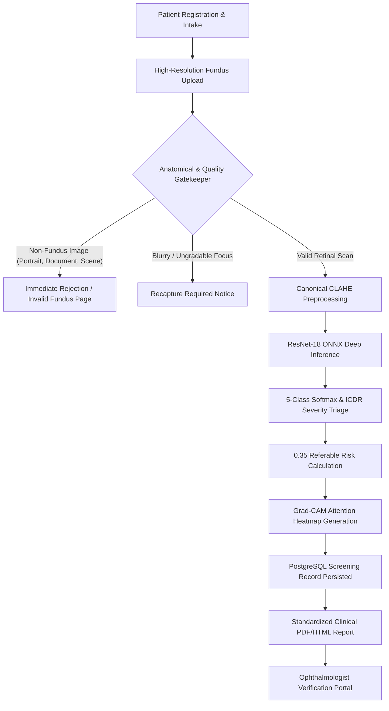
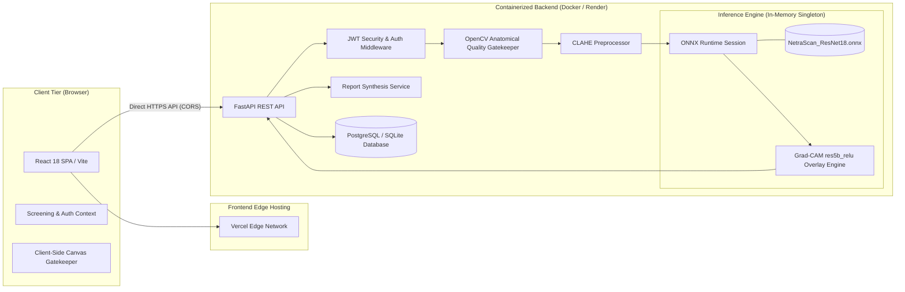

# NetraScan — Local-First AI Retinal Screening Platform

[](https://www.python.org/)
[](https://fastapi.tiangolo.com/)
[](https://onnxruntime.ai/)
[](https://react.dev/)
[](https://vitejs.dev/)
[](https://sqlite.org/)
[](https://opensource.org/licenses/MIT)

**NetraScan** is a self-contained, local-first AI retinal screening platform designed to analyze digital ophthalmic fundus photographs using a deep-learning inference pipeline and provide explainable clinical screening reports. It integrates automated anatomical quality gatekeeping, contrast-limited adaptive histogram equalization (CLAHE), ResNet-18 deep convolutional neural network inference via ONNX Runtime, authentic Grad-CAM explainability on convolutional feature maps, local Primary Health Centre (PHC) fleet management, and printable clinical report generation.

---

Step 1: Start the Backend (Port 8000)

# 1. Create and activate virtual environment
python3 -m venv venv
source venv/bin/activate

# 2. Install backend dependencies
pip install -r backend/requirements.txt

# 3. Start the local FastAPI server
PYTHONPATH=backend uvicorn main:app --app-dir backend --reload --port 8000
Verify backend health:

curl http://localhost:8000/health/model
Step 2: Start the Frontend (Port 5173)

# In a new terminal tab:
cd frontend
npm install
npm run dev
Open http://localhost:5173 in your browser.

**Login id : PHC-PUNE-001**
**Password : NetraScan@123**

> [!IMPORTANT]
> **Clinical Decision-Support Notice & Disclaimer**: NetraScan is an AI-assisted screening and research platform in active development. It is designed to assist healthcare workers in triage and prioritization; it does **not** provide definitive medical diagnoses and does **not** replace evaluation by a licensed ophthalmologist or retina specialist.

---

# ⚙️ Environment Variables

## Backend Configuration (`backend/.env`)

```env
# Application Settings
ENVIRONMENT=development
PORT=8000
API_V1_STR=/api

# Security & JWT
JWT_SECRET_KEY=local-development-secret-key-netrascan-2026
ACCESS_TOKEN_EXPIRE_MINUTES=1440

# Local Database (Self-contained SQLite)
DATABASE_URL=sqlite:///./netrascan.db

# Local ResNet-18 ONNX Model
MODEL_PATH=ml-training/models/NetraScan_ResNet18.onnx
BLUR_THRESHOLD=35.0
REFERABLE_THRESHOLD=0.35
```

## Frontend Configuration (`frontend/.env`)

```env
VITE_AI_API_URL=http://localhost:8000
VITE_API_URL=http://localhost:8000
VITE_API_BASE_URL=http://localhost:8000/api
```

---

## 📑 Table of Contents
- [⚙️ Environment Variables](#️-environment-variables)
- [Quick Start: Running Locally](#-quick-start-running-locally)
- [Project Overview & Workflow](#-project-overview--workflow)
- [Key Features & Working Capabilities](#-key-features--working-capabilities)
- [System Architecture](#-system-architecture)
- [Deep Learning Pipeline & ICDR Classification](#-deep-learning-pipeline--icdr-classification)
- [Repository Structure](#-repository-structure)
- [API Reference & Diagnostic Endpoints](#-api-reference--diagnostic-endpoints)
- [Verification & Automated Test Suites](#-verification--automated-test-suites)

---

## 🌟 Project Overview & Workflow

In rural and underserved primary health networks, access to specialized ophthalmologists is limited. Diabetic Retinopathy (DR) often progresses asymptomatically until irreversible vision loss occurs. NetraScan provides an automated, rapid-triage pipeline capable of evaluating retinal fundus scans within milliseconds:



### End-to-End Clinical Flow:
1. **Patient Intake**: Register new patients or link existing records with demographic data, diabetes type, duration, and examined eye (`OD - Right Eye` / `OS - Left Eye`).
2. **Fundus Image Upload**: Ingest standard ophthalmic fundus camera images (`JPEG`, `PNG`, `WEBP`, `BMP`, `TIFF`).
3. **Anatomical Validation Gate**: Multi-signal algorithmic filter instantly detects and rejects non-retinal images (human portraits, selfies, documents, animals, scenery, screenshots) before expensive neural inference.
4. **Clarity / Blur Gate**: Computes ROI-masked Laplacian variance ($\text{Threshold} = 35.0$) to flag ungradable scans requiring optical recapture.
5. **Canonical Preprocessing**: Standardizes input to $224 \times 224 \times 3$, applies channel-wise Adaptive Histogram Equalization matching MATLAB canonical specifications, and formats float32 NCHW tensors.
6. **ResNet-18 Inference**: Executes the finalized deep residual network on ONNX Runtime (`CPUExecutionProvider`) with persistent, in-memory model weights.
7. **Clinical Triage**: Classifies into standard ICDR stages (Grade 0 to 4) and flags referable cases ($\sum_{g=2}^4 P(g) \ge 0.35$).
8. **Explainable AI (Grad-CAM)**: Extracts `res5b_relu` activation maps to project visual heatmaps indicating lesions, microaneurysms, and hemorrhages.
9. **Clinical Report Synthesis**: Generates printable, tamper-evident clinical summary sheets with biometric findings, confidence graphs, and doctor verification controls.

---

## ✨ Key Features & Working Capabilities

### Operational in Live Release:
- ✅ **Strict Fundus Anatomical Gatekeeper**: Rejects non-medical and non-fundus photographs in $<15\text{ ms}$ before neural computation.
- ✅ **Pre-warmed ONNX Inference Session**: Singleton model lifecycle loaded once at boot, maintaining sub-$40\text{ ms}$ inference latencies.
- ✅ **Authentic Grad-CAM Explainability**: Class activation mapping dynamically extracted from intermediate `res5b_relu` convolutional tensor outputs.
- ✅ **Multi-Tenant PHC & Role-Based Security**: Role-based access control (`SUPER_ADMIN`, `PHC_STAFF`, `DOCTOR`) with JWT authentication and password hashing.
- ✅ **PostgreSQL Clinical Record Store**: Persistent screening history, patient UID generation, and doctor verification decision logging.
- ✅ **Dynamic Diagnostic UI**: Finite state transitions with progressive stage trackers, live execution timers, and actionable retry controls.
- ✅ **Containerized ML Runtime**: Production Docker setup optimized with single-worker concurrency throttles to prevent container memory limit crashes.

### Under Development / Planned Capabilities:
- ⏳ **Automated Microvascular Lesion Segmentation**: Fine-grained pixel-level segmentation of cotton-wool spots and hard exudates.
- ⏳ **Offline-First PWA Progressive Sync**: Edge inference via ONNX Runtime WebAssembly (WASM) for completely offline rural health outposts.
- ⏳ **FHIR / HL7 Diagnostic Interoperability**: Direct integration with hospital Electronic Medical Records (EMR) systems.

---

## 🏗️ System Architecture



### Component Breakdown:
| Layer | Technologies | Responsibilities |
| :--- | :--- | :--- |
| **Frontend UI** | React 18, Vite, Lucide Icons, React Router DOM | Patient workflow, upload interface, live inference progress, interactive results, reports |
| **API Backend** | FastAPI, Python 3.11, Uvicorn, Pydantic v2 | RESTful route handling, role authentication, multi-tenant isolation, telemetry |
| **ML Runtime** | ONNX Runtime 1.18+, NumPy, OpenCV (Headless) | ResNet-18 forward pass, float32 NCHW tensor formatting, CLAHE enhancement |
| **Explainability** | NumPy, OpenCV, Pillow | Class activation map extraction on `res5b_relu`, JET colormapping, base64 overlays |
| **Persistence** | SQLAlchemy 2.0, PostgreSQL / SQLite, Alembic | Patient registry, historical screenings, verification audit trails, PHC fleet data |
| **Deployment** | Docker (`python:3.11-slim`), Vercel, Render | Containerized single-worker ML service with persistent memory allocation |

---

## 🧠 Deep Learning Pipeline & ICDR Classification

NetraScan implements the 5-stage **International Clinical Diabetic Retinopathy (ICDR)** disease severity scale:

| Grade | Clinical Designation | Characteristics / Evidence | Referral Action |
| :---: | :--- | :--- | :---: |
| **Grade 0** | **No Diabetic Retinopathy** | Clear retinal fundus, healthy macula, distinct optic disc margin, no microaneurysms | Routine annual follow-up |
| **Grade 1** | **Mild Non-Proliferative DR** | Isolated microaneurysms, minimal punctate intraretinal hemorrhages | Re-screen in 6–12 months |
| **Grade 2** | **Moderate Non-Proliferative DR** | Multiple microaneurysms, hard exudates, venous caliber changes, blot hemorrhages | **Refer to Ophthalmologist** |
| **Grade 3** | **Severe Non-Proliferative DR** | $>20$ intraretinal hemorrhages in all 4 quadrants, venous beading in $\ge 2$ quadrants, IRMA $\ge 1$ quadrant | **Urgent Specialist Referral** |
| **Grade 4** | **Proliferative DR** | Neovascularization at optic disc (NVD/NVE), preretinal/vitreous hemorrhage, fibrovascular proliferation | **Emergency Retina Referral** |

### Referable DR Decision Rule:
An affirmative referral flag is triggered whenever the cumulative probability of moderate or advanced retinopathy exceeds the safety threshold:
$$\text{Referable DR} = \left( \sum_{g=2}^{4} P(\text{Grade } g) \ge 0.35 \right)$$

---

## 📂 Repository Structure

```text
NetraScan/
├── Dockerfile                     # Production container definition (Python 3.11-slim, ONNX Runtime)
├── docker-compose.yml             # Local multi-service orchestration definition
├── backend/                       # FastAPI application & ML service
│   ├── main.py                    # API entrypoint, health probes, CORS, and router registration
│   ├── schemas.py                 # Pydantic v2 data models, validation contracts, and responses
│   ├── api/                       # REST API router endpoints
│   │   ├── auth.py                # JWT authentication, login, profile, user registration
│   │   ├── patients.py            # Patient registry, search, update, and history
│   │   ├── screenings.py          # Screening multipart ingest, inference pipeline, doctor verification
│   │   ├── phcs.py                # Primary Health Centre fleet management
│   │   └── dashboard.py           # District triage aggregates and statistics
│   ├── core/                      # Core configuration and security
│   │   ├── config.py              # Environment configuration settings
│   │   └── security.py            # Password hashing, JWT token encoding, RBAC dependency guards
│   ├── db/                        # Database models and session lifecycle
│   │   ├── models.py              # SQLAlchemy declarative models (User, Patient, Screening, PHC)
│   │   ├── session.py             # Database engine, connection pooling, and session provider
│   │   └── init_db.py             # Schema initialization and default PHC/User seed data
│   ├── services/                  # Business logic & ML execution services
│   │   ├── ai_service.py          # Singleton ONNX inference session and pipeline orchestration
│   │   ├── file_validation_service.py # Multi-signal fundus gatekeeper and Laplacian blur analyzer
│   │   ├── preprocessing.py       # Canonical MATLAB CLAHE contrast enhancement & tensor formatting
│   │   ├── gradcam.py             # Authentic res5b_relu Grad-CAM class activation mapping engine
│   │   └── report_service.py      # Standardized clinical report synthesis
│   └── tests/                     # Automated unit and integration test suites
│
├── frontend/                      # React 18 / Vite Single Page Application
│   ├── src/
│   │   ├── components/            # Reusable UI components (Navbar, Footers, Visual Icons)
│   │   ├── context/               # React Context Providers (ScreeningContext, AuthContext)
│   │   ├── pages/                 # Route pages (Home, Screening, Analysis, Results, Login, Dashboard)
│   │   ├── services/              # API clients and client-side canvas validation
│   │   │   ├── api.js             # Centralized API service with timeout and retry controls
│   │   │   └── imageValidation.js # Fast client-side anatomical canvas gatekeeper
│   │   └── styles/                # Global and component stylesheets
│   ├── package.json               # Frontend dependencies and scripts
│   └── vite.config.js             # Vite build and proxy configuration
│
├── ml-training/                   # Machine learning assets & ONNX model
│   ├── models/
│   │   └── NetraScan_ResNet18.onnx # Finalized 5-class MATLAB ResNet-18 ONNX model (44.78 MB)
│   └── preprocessing/
│       └── preprocess_fundus.m    # Canonical MATLAB preprocessing reference
│
├── simulink/                      # MATLAB & Simulink simulation framework
│   ├── NetraScan_Simulink.slx     # 8-stage visual AI inference Simulink model
│   └── scripts/                   # Simulation, validation, and district queue scripts
│
└── demo_samples/                  # Validated test fixtures (Normal, Moderate DR, Severe High-Res, Blurry)
```

---

## 📡 API Reference & Diagnostic Endpoints

### 🩺 System & Diagnostic Probes
| Method | Endpoint | Description | Auth Required |
| :--- | :--- | :--- | :---: |
| `GET` | `/health` | Server health, mode, and model loading telemetry | No |
| `GET` | `/health/model` | Detailed ONNX Runtime status and memory readiness | No |
| `GET` | `/ready` | Readiness probe for container orchestrators | No |

### 🔐 Authentication (`/api/auth`)
| Method | Endpoint | Description | Auth Required |
| :--- | :--- | :--- | :---: |
| `POST` | `/api/auth/login` | Authenticate PHC staff/doctor and retrieve JWT token | No |
| `GET` | `/api/auth/me` | Fetch current authenticated user profile and PHC assignment | Yes |
| `POST` | `/api/auth/users` | Register a new healthcare staff account (Admin only) | Yes |

### 🔬 Screenings & AI Inference (`/api/screenings`)
| Method | Endpoint | Description | Auth Required |
| :--- | :--- | :--- | :---: |
| `POST` | `/api/screenings` | Multipart upload: validates fundus, runs ONNX inference, persists record | Yes |
| `GET` | `/api/screenings` | List screenings with optional verification filter (`?doctor_verified=true`) | Yes |
| `GET` | `/api/screenings/{id}` | Fetch full diagnostic record, Grad-CAM heatmap, and probabilities | Yes |
| `POST` | `/api/screenings/{id}/verify` | Record ophthalmologist confirmation decision and clinical notes | Yes |
| `GET` | `/api/screenings/{id}/report` | Download standardized printable clinical HTML/PDF report | Yes |

### 👥 Patient Management (`/api/patients`)
| Method | Endpoint | Description | Auth Required |
| :--- | :--- | :--- | :---: |
| `GET` | `/api/patients` | Retrieve patient directory for active PHC | Yes |
| `POST` | `/api/patients` | Register new screening intake record in PostgreSQL | Yes |
| `GET` | `/api/patients/{id}` | Fetch patient clinical profile and historical screenings | Yes |

---

## 🚀 Quick Start: Running Locally

### Prerequisites
- **Python**: `3.10` or `3.11`
- **Node.js**: `18.x` or `20.x`

---

### Step 1: Start the Backend (Port 8000)

```bash
# 1. Create and activate virtual environment
python3 -m venv venv
source venv/bin/activate

# 2. Install backend dependencies
pip install -r backend/requirements.txt

# 3. Start the local FastAPI server
PYTHONPATH=backend uvicorn main:app --app-dir backend --reload --port 8000
```

Verify backend health:
```bash
curl http://localhost:8000/health/model
```

---

### Step 2: Start the Frontend (Port 5173)

```bash
# In a new terminal tab:
cd frontend
npm install
npm run dev
```

Open `http://localhost:5173` in your browser.

---

---

### 🔑 Default Login Credentials & Access Roles:

| Role | Username / ID / Email | Password | Access Level |
| :--- | :--- | :--- | :--- |
| **Primary Health Staff (Default)** | `PHC-PUNE-001` | `NetraScan@123` | Patient intake, fundus screening, report generation |
| **Super Administrator** | `admin@netrascan.org` | `NetraScan@Admin2026` | Full platform management, multi-PHC fleet analytics |
| **Ophthalmologist / Doctor** | `doctor.pune@netrascan.org` | `Doctor@Pune123` | Clinical review, report verification, referral sign-off |
| **PHC Field Staff** | `staff.pune@netrascan.org` | `Staff@Pune123` | Patient intake & screening execution |

---

## 🔬 MATLAB & Simulink Systems Modeling

In addition to the production web runtime, NetraScan includes a complete visual systems-engineering and district queue modeling framework under `simulink/`:

```matlab
% 1. Load ONNX model and configure simulation environment
cd simulink/scripts
simConfig = setup_netrascan_sim();

% 2. Execute single-image Simulink visual inference simulation
results = run_netrascan_sim('../../demo_samples/fundus_grade0_normal.jpg');

% 3. Open interactive Simulink model
open_system('NetraScan_Simulink.slx');
sim('NetraScan_Simulink');

% 4. Run district healthcare queue and capacity simulation
simReport = patient_queue_sim();
```

---

## 🧪 Verification & Automated Test Suites

NetraScan includes diagnostic test fixtures and automated test suites:

```bash
# 1. Run unit test discovery across backend
cd backend
python -m unittest discover -s tests

# 2. Run end-to-end inference benchmark on high-resolution fundus scans
PYTHONPATH=backend python -c "
import cv2, time
from services.ai_service import AIService
from services.file_validation_service import assess_basic_integrity

img_path = 'demo_samples/user_uploaded_highres_fundus.jpg'
is_pass, gate, metric, _, _ = assess_basic_integrity(img_path)
ai = AIService()
res = ai.analyze_fundus(img_path, 'highres.jpg', metric)
print(f'Prediction: Grade {res.dr_grade} ({res.severity_label}), Confidence: {res.confidence*100:.2f}%, Latency: {res.model.inference_time_ms}ms')
"
```

---

## 🌐 Deployment Architecture

- **Frontend**: Deployed on **Vercel** (`https://netra-scan-nu.vercel.app`) using static Single Page Application builds.
- **Backend**: Containerized with **Docker** on **Render** (`https://netrascan-4cem.onrender.com`) with persistent memory allocations.
- **Communication**: Direct HTTPS REST communication over TLS with strict CORS origin verification.

---

## 📄 License
This project is distributed under the **MIT License**. See the `LICENSE` file for more information.
