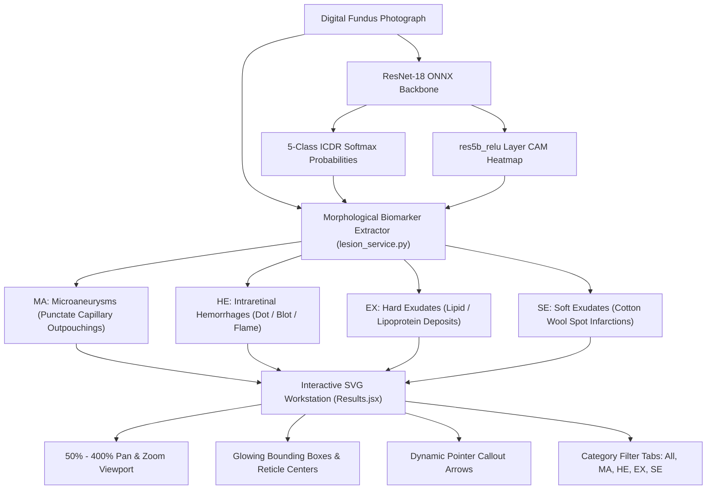
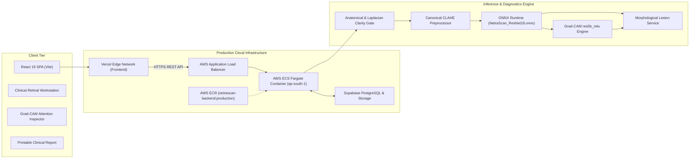

# NetraScan — AI Clinical Retinal Screening & Diagnostic Workstation

[](https://www.python.org/)
[](https://fastapi.tiangolo.com/)
[](https://onnxruntime.ai/)
[](https://react.dev/)
[](https://vitejs.dev/)
[](https://aws.amazon.com/ecs/)
[](https://netra-scan-nu.vercel.app)
[](https://opensource.org/licenses/MIT)

**NetraScan** is an end-to-end, clinical-grade AI retinal screening workstation designed to triage digital ophthalmic fundus photographs. Powered by a finalized ResNet-18 deep convolutional neural network via ONNX Runtime, it delivers **5-class ICDR severity classification**, **authentic `res5b_relu` Grad-CAM attention heatmaps**, **morphological biomarker localization (Microaneurysms, Hemorrhages, Hard & Soft Exudates)** with synchronized SVG callout arrows and bounding boxes, multi-tenant Primary Health Centre (PHC) management, and printable clinical audit reports.

---

## 🌐 Live Production Deployment

- **Web Application (Vercel)**: [https://netra-scan-nu.vercel.app](https://netra-scan-nu.vercel.app)
- **AI Inference Backend (AWS ECS Fargate `ap-south-1`)**: `https://ne-ef6c85ddd0fc44bfbd12502b61eee466.ecs.ap-south-1.on.aws`
- **Default Clinical Demo Login**:
  - **PHC ID**: `PHC-PUNE-001`
  - **Password**: `NetraScan@123`

---

## 📑 Table of Contents
- [🚀 Quick Start: Running Locally](#-quick-start-running-locally)
- [🔬 Interactive Clinical Retinal Workstation](#-interactive-clinical-retinal-workstation)
- [🧠 Deep Learning Inference Pipeline](#-deep-learning-inference-pipeline)
- [🏗️ System Architecture](#️-system-architecture)
- [📂 Repository Structure](#-repository-structure)
- [📡 API Reference & Diagnostic Endpoints](#-api-reference--diagnostic-endpoints)
- [🔐 Access Roles & Default Credentials](#-access-roles--default-credentials)
- [🧪 Automated Verification & Benchmarks](#-automated-verification--benchmarks)
- [⚙️ Environment Configuration](#️-environment-configuration)

---

## 🚀 Quick Start: Running Locally

### Prerequisites
- **Python**: `3.10` or `3.11`
- **Node.js**: `18.x`, `20.x`, or `22.x`
- **Git LFS** (for downloading the 44.8 MB ONNX model weights)

```bash
# 1. Clone the repository and fetch LFS model assets
git clone https://github.com/princetiwari1910/NetraScan.git
cd NetraScan
git lfs pull
```

---

### Step 1: Start the Backend (Port 8000)

```bash
# 1. Create and activate virtual environment
python3 -m venv venv
source venv/bin/activate

# 2. Install dependencies
pip install -r backend/requirements.txt

# 3. Launch FastAPI backend
PYTHONPATH=backend uvicorn main:app --host 0.0.0.0 --port 8000 --app-dir backend --reload
```

Verify backend health:
```bash
curl http://localhost:8000/health
```

---

### Step 2: Start the Frontend (Port 5173)

```bash
# Open a new terminal tab:
cd frontend
npm install

# Start Vite dev server connecting to local backend
VITE_API_BASE_URL=http://localhost:8000 npm run dev
```

Visit **`http://localhost:5173`** in your browser and sign in with:
- **PHC ID**: `PHC-PUNE-001`
- **Password**: `NetraScan@123`

---

## 🔬 Interactive Clinical Retinal Workstation

NetraScan provides an ophthalmologist-grade interactive viewport designed for detailed microvascular inspection:


```mermaid
flowchart TD
    A["Digital Fundus Photograph"] --> B["ResNet-18 ONNX Backbone"]
    B --> C["5-Class ICDR Softmax Probabilities"]
    B --> D["res5b_relu Layer CAM Heatmap"]
    A & C & D --> E["Morphological Biomarker Extractor (lesion_service.py)"]
    E --> F1["MA: Microaneurysms (Punctate Capillary Outpouchings)"]
    E --> F2["HE: Intraretinal Hemorrhages (Dot / Blot / Flame)"]
    E --> F3["EX: Hard Exudates (Lipid / Lipoprotein Deposits)"]
    E --> F4["SE: Soft Exudates (Cotton Wool Spot Infarctions)"]
    F1 & F2 & F3 & F4 --> G["Interactive SVG Workstation (Results.jsx)"]
    G --> H1["50% - 400% Pan & Zoom Viewport"]
    G --> H2["Glowing Bounding Boxes & Reticle Centers"]
    G --> H3["Dynamic Pointer Callout Arrows"]
    G --> H4["Category Filter Tabs: All, MA, HE, EX, SE"]
```

### Biomarker Classifications:
| Biomarker Code | Pathological Finding | Color Code | Clinical Significance |
| :---: | :--- | :---: | :--- |
| **`MA`** | **Microaneurysm** | `#EF4444` (Red) | Earliest visible sign of diabetic microvascular damage; focal capillary outpouchings. |
| **`HE`** | **Intraretinal Hemorrhage** | `#F97316` (Orange) | Ruptured capillaries presenting as dot, blot, or flame-shaped intraretinal hemorrhages. |
| **`EX`** | **Hard Exudate** | `#EAB308` (Yellow) | Waxy, reflective lipid and lipoprotein precipitates caused by chronic vascular leakage. |
| **`SE`** | **Soft Exudate (Cotton Wool)** | `#0284C7` (Cyan) | Nerve fiber layer microinfarctions indicating acute localized retinal ischemia. |

---

## 🧠 Deep Learning Inference Pipeline

NetraScan implements the **International Clinical Diabetic Retinopathy (ICDR)** standard 5-stage triage scale:

| ICDR Grade | Clinical Designation | Pathological Criteria | Clinical Action |
| :---: | :--- | :--- | :---: |
| **Grade 0** | **No Diabetic Retinopathy** | Clear fundus, sharp disc margins, no microaneurysms or hemorrhages. | Routine annual follow-up |
| **Grade 1** | **Mild Non-Proliferative DR** | Isolated microaneurysms only; no observable hemorrhages or exudates. | Re-screen in 6–12 months |
| **Grade 2** | **Moderate Non-Proliferative DR** | Multiple microaneurysms, blot hemorrhages, hard lipid exudates. | **Refer to Ophthalmologist** |
| **Grade 3** | **Severe Non-Proliferative DR** | $>20$ intraretinal hemorrhages in 4 quadrants, venous beading in $\ge 2$ quadrants, or IRMA $\ge 1$ quadrant. | **Urgent Specialist Referral** |
| **Grade 4** | **Proliferative DR** | Neovascularization at optic disc (NVD/NVE), vitreous hemorrhage, or fibrovascular proliferation. | **Emergency Retina Specialist** |

### Calibrated Referable DR Decision Rule:
An affirmative clinical referral flag is triggered whenever the cumulative risk of moderate or vision-threatening retinopathy exceeds the calibrated threshold:
$$\text{Referable DR} \iff \sum_{g=2}^{4} P(\text{Grade } g) \ge 0.35$$

---

## 🏗️ System Architecture


```mermaid
flowchart LR
    subgraph Client["Client Tier"]
        UI["React 19 SPA (Vite)"]
        WS["Clinical Retinal Workstation"]
        CAM_VIEW["Grad-CAM Attention Inspector"]
        PDF["Printable Clinical Report"]
    end

    subgraph Cloud["Production Cloud Infrastructure"]
        VCL["Vercel Edge Network (Frontend)"]
        ALB["AWS Application Load Balancer"]
        ECS["AWS ECS Fargate Container (ap-south-1)"]
        ECR["AWS ECR (netrascan-backend:production)"]
        SUPA["Supabase PostgreSQL & Storage"]
    end

    subgraph Engine["Inference & Diagnostics Engine"]
        GATE["Anatomical & Laplacian Clarity Gate"]
        CLAHE["Canonical CLAHE Preprocessor"]
        ONNX["ONNX Runtime (NetraScan_ResNet18.onnx)"]
        GRAD["Grad-CAM res5b_relu Engine"]
        LESION["Morphological Lesion Service"]
    end

    UI --> VCL
    VCL -- "HTTPS REST API" --> ALB
    ALB --> ECS
    ECR -.-> ECS
    ECS --> GATE --> CLAHE --> ONNX
    ONNX --> GRAD
    ONNX & GRAD --> LESION
    ECS <--> SUPA
```

---

## 📂 Repository Structure

```text
NetraScan/
├── backend/                       # FastAPI backend & deep learning pipeline
│   ├── main.py                    # API entrypoint, health probes, CORS, and route registration
│   ├── schemas.py                 # Pydantic v2 data models and validation contracts
│   ├── api/                       # REST API endpoints
│   │   ├── auth.py                # JWT authentication, PHC staff & doctor login
│   │   ├── patients.py            # Patient registry, search, and screening history
│   │   ├── screenings.py          # Multipart fundus ingest, inference, and doctor review
│   │   ├── phcs.py                # Primary Health Centre fleet management
│   │   └── dashboard.py           # District triage aggregates and statistics
│   ├── core/                      # Configuration, environment, and security utilities
│   ├── db/                        # SQLAlchemy database models and connection session
│   ├── services/                  # Core algorithmic services
│   │   ├── ai_service.py          # Singleton ONNX Runtime session & inference pipeline
│   │   ├── lesion_service.py      # Morphological multi-scale lesion extraction (MA, HE, EX, SE)
│   │   ├── gradcam.py             # Authentic res5b_relu Grad-CAM heatmap generator
│   │   ├── preprocessing.py       # Canonical CLAHE contrast enhancement (224x224x3 NCHW)
│   │   ├── file_validation_service.py # Retinal anatomical gatekeeper & Laplacian blur detector
│   │   └── report_service.py      # Standardized clinical PDF/HTML report synthesis
│   └── tests/                     # Unit and integration test suites
│
├── frontend/                      # React 19 / Vite Single Page Application
│   ├── src/
│   │   ├── components/            # Workstation components, navbar, HUD reticles
│   │   ├── context/               # ScreeningContext, AuthContext
│   │   ├── pages/                 # Home, Analysis, Results, Report, DoctorReview, Login
│   │   ├── services/              # API clients & client-side lesion detector
│   │   │   ├── api.js             # Centralized API service with auto-retry
│   │   │   └── lesionDetector.js  # Biomarker normalizer & canvas morphological extractor
│   │   └── styles/                # Workstation styling & responsive layouts
│   ├── package.json               # Frontend dependencies (React 19, Lucide, React Router)
│   └── vite.config.js             # Vite bundler configuration
│
├── ml-training/                   # Machine learning assets
│   └── models/
│       └── NetraScan_ResNet18.onnx # Finalized MATLAB ResNet-18 ONNX model (44.78 MB)
│
├── demo_samples/                  # Validated test fundus photographs (Grade 0 to 4, Blurry)
└── docs/                          # Comprehensive architectural and clinical reports
```

---

## 📡 API Reference & Diagnostic Endpoints

### 🩺 System & Diagnostic Probes
| Method | Endpoint | Description | Auth Required |
| :--- | :--- | :--- | :---: |
| `GET` | `/health` | Server status, runtime provider, and model loading state | No |
| `GET` | `/health/model` | Memory footprint and ONNX session readiness probe | No |
| `GET` | `/ready` | Container orchestrator readiness probe | No |

### 🔐 Authentication (`/api/auth`)
| Method | Endpoint | Description | Auth Required |
| :--- | :--- | :--- | :---: |
| `POST` | `/api/auth/login` | Authenticate PHC staff or doctor; returns JWT bearer token | No |
| `GET` | `/api/auth/me` | Retrieve authenticated user profile and assigned PHC code | Yes |

### 🔬 Screenings & AI Inference (`/api/screenings`)
| Method | Endpoint | Description | Auth Required |
| :--- | :--- | :--- | :---: |
| `POST` | `/api/screenings` | Upload fundus image, execute gatekeeper, run ONNX inference, return lesions | Yes |
| `GET` | `/api/screenings` | List historical screenings with optional doctor verification filter | Yes |
| `GET` | `/api/screenings/{id}` | Fetch full diagnostic record, Grad-CAM heatmap, and lesion findings | Yes |
| `POST` | `/api/screenings/{id}/verify` | Submit licensed ophthalmologist verification and clinical notes | Yes |
| `GET` | `/api/screenings/{id}/report` | Download official clinical summary report | Yes |

---

## 🔐 Access Roles & Default Credentials

| Role | Username / ID | Password | Permissions |
| :--- | :--- | :--- | :--- |
| **Primary Health Staff (Default)** | `PHC-PUNE-001` | `NetraScan@123` | Patient intake, fundus screening, report generation |
| **District Administrator** | `admin@netrascan.org` | `NetraScan@Admin2026` | Multi-PHC fleet analytics, user management |
| **Consultant Ophthalmologist** | `doctor.pune@netrascan.org` | `Doctor@Pune123` | Clinical review, report verification, referral sign-off |

---

## 🧪 Automated Verification & Benchmarks

Run automated verification against genuine fundus test fixtures:

```bash
# 1. Run full Python test suite
PYTHONPATH=backend ./venv/bin/python -m unittest discover -s backend/tests

# 2. Benchmark ONNX model inference and lesion extraction
PYTHONPATH=backend ./venv/bin/python -c "
import cv2
from services.ai_service import AIService
from services.lesion_service import extract_retinal_lesions

ai = AIService()
img = cv2.imread('demo_samples/Grade3.jpeg')
res = ai.predict(open('demo_samples/Grade3.jpeg', 'rb').read())
print(f'ICDR: Grade {res[\"predicted_grade\"]} ({res[\"severity_label\"]}) | Confidence: {res[\"confidence\"]*100:.2f}%')
print(f'Total Lesions: {res[\"lesions\"][\"total_count\"]} | By Type: {res[\"lesions\"][\"by_type\"]}')
"
```

---

## ⚙️ Environment Configuration

### Backend (`backend/.env`)
```env
ENVIRONMENT=development
PORT=8000
API_V1_STR=/api
JWT_SECRET_KEY=local-development-secret-key-netrascan-2026
ACCESS_TOKEN_EXPIRE_MINUTES=1440
DATABASE_URL=sqlite:///./netrascan.db
MODEL_PATH=ml-training/models/NetraScan_ResNet18.onnx
BLUR_THRESHOLD=35.0
REFERABLE_THRESHOLD=0.35
```

### Frontend (`frontend/.env`)
```env
# Local Development:
VITE_API_BASE_URL=http://localhost:8000

# Cloud Production (AWS ECS):
# VITE_API_BASE_URL=https://ne-ef6c85ddd0fc44bfbd12502b61eee466.ecs.ap-south-1.on.aws
```

---

## 📄 Clinical Decision-Support Disclaimer

> [!IMPORTANT]
> **Clinical Notice**: NetraScan is an artificial intelligence-assisted triage and clinical decision-support platform designed to assist healthcare personnel in screening and prioritization. It is **not** a standalone diagnostic device and does **not** substitute for evaluation by a certified ophthalmologist or retina specialist.

---

## 📄 License
Distributed under the **MIT License**. See `LICENSE` for details.
