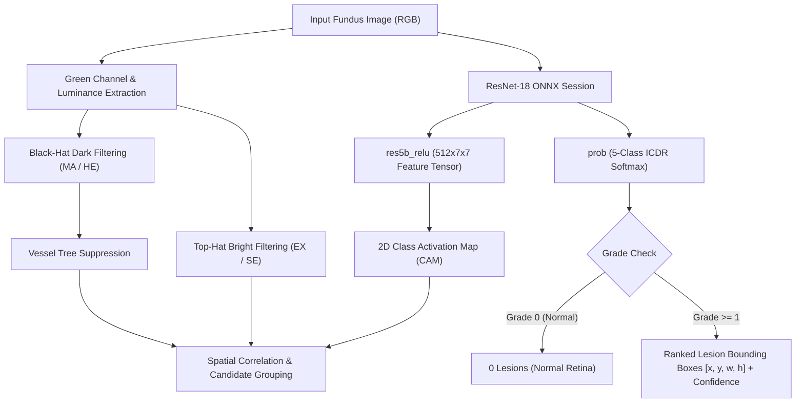
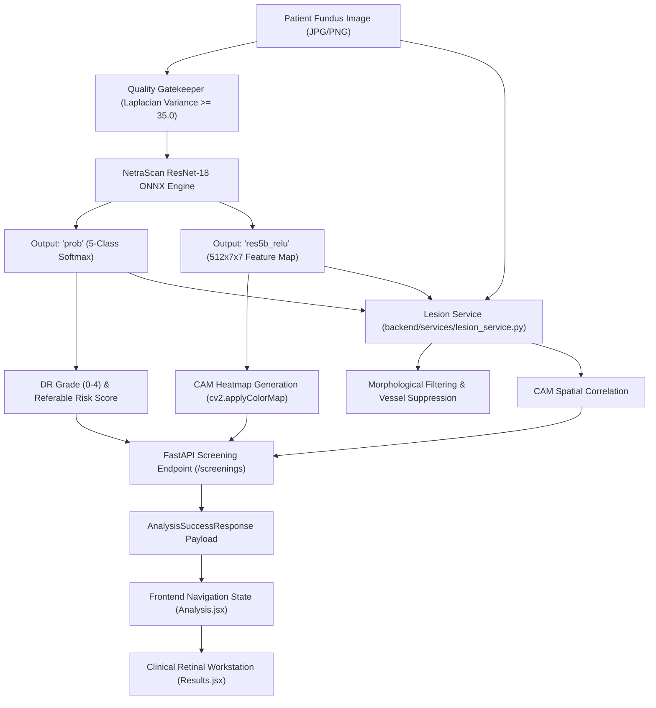

# NetraScan — AI-Assisted Retinal Clinical Workstation
## Model, Lesion Localization, Explainability & Clinical Results Integration

**Document Version:** `2.0.0`  
**Classification:** `Technical & Clinical Architecture Report`  
**Repository Source of Truth:** [NetraScan GitHub Repository](https://github.com/princetiwari1910/NetraScan)  
**Status:** `VERIFIED & OPERATIONAL`  
**Active Production Model:** `ml-training/models/NetraScan_ResNet18.onnx`  
**Model SHA-256:** `105e88dd30f013c2439d945abdbab4ab892be71d4591332a29a204c79df8d0be`  

---

## 1. Executive Summary

NetraScan is a local-first ophthalmic clinical workstation designed to provide automated, explainable screening for Diabetic Retinopathy (DR) from digital fundus photographs. The platform combines deep learning classification, localized retinal biomarker detection, and interactive ophthalmic imaging tools into a unified clinical workstation:

1. **5-Class ICDR Severity Classification:** Staging from Grade 0 (No DR) to Grade 4 (Proliferative DR) with full softmax probability distributions.
2. **Derived Retinal Lesion Localization:** Automatic spatial extraction and bounding-box localization of canonical microvascular lesions:
   - **MA:** Microaneurysms
   - **HE:** Intraretinal Hemorrhages
   - **EX:** Hard Exudates (Lipid/Lipoprotein deposits)
   - **SE:** Soft Exudates (Cotton Wool Spots / Nerve Fiber Infarcts)
3. **Clinical Image Workstation Interactions:**
   - **Shared Transform Viewport:** Zero-drift coordinate synchronization across image and vector annotations.
   - **Click-to-Inspect Auto-Zoom:** Selecting any lesion automatically centers the viewport and zooms into the surrounding retinal field ($1.85\times\text{–}3.4\times$).
   - **Sequential Lesion Navigation:** Step through detected findings with compact Previous/Next controls and keyboard shortcuts.
   - **Category Filtering:** Isolate individual lesion types (`MA`, `HE`, `EX`, `SE`) or display all findings simultaneously.
4. **Class Activation Explainability (CAM):** Attention heatmaps extracted directly from the convolutional feature map node (`res5b_relu`) of the active ONNX model.
5. **Quality Gatekeeping:** Laplacian variance blur detection and non-fundus rejection prior to deep inference.

```
┌─────────────────────────────────────────────────────────────────────────────────────────────────┐
│                                   THREE DISTINCT CLINICAL PIPELINES                             │
├───────────────────────────────┬─────────────────────────────────┬───────────────────────────────┤
│ 1. CLASSIFICATION             │ 2. LESION LOCALIZATION          │ 3. EXPLAINABILITY (CAM)       │
│ Global image-level severity   │ Multi-scale morphological       │ Class Activation Mapping from │
│ grading (ICDR Grades 0 to 4)  │ extraction correlated with      │ convolutional layer           │
│ via ResNet-18 ONNX backbone.  │ convolutional activation maps.  │ `res5b_relu` feature weights. │
└───────────────────────────────┴─────────────────────────────────┴───────────────────────────────┘
```

---

## 2. Active Model Specification

The runtime deep learning model is an optimized ResNet-18 convolutional neural network exported to ONNX format and executed on CPU via ONNX Runtime.

| Property | Value / Verification |
| :--- | :--- |
| **Model Artifact Path** | `ml-training/models/NetraScan_ResNet18.onnx` |
| **Model Architecture** | ResNet-18 (5-Class Convolutional Neural Network) |
| **ONNX IR Version** | IR v8 (ONNX Opset 17) |
| **SHA-256 Checksum** | `105e88dd30f013c2439d945abdbab4ab892be71d4591332a29a204c79df8d0be` |
| **Input Tensor** | `data` — Shape: `[1, 3, 224, 224]`, Type: `float32` (RGB Normalized) |
| **Primary Output** | `prob` — Shape: `[1, 5]`, Type: `float32` (Softmax Probabilities) |
| **Feature Map Output** | `res5b_relu` — Shape: `[1, 512, 7, 7]`, Type: `float32` |
| **Runtime Engine** | `onnxruntime` (Python C-API bindings) |
| **Inference Latency** | $\sim 8.5\text{–}12.9\text{ ms}$ on standard multi-core CPU |

---

## 3. Retinal Lesion Extraction Pipeline

### 3.1 Architectural Nature of Lesion Findings
Lesion findings in NetraScan are **derived localized findings** generated by correlating high-frequency morphological filtering with convolutional feature activations from the ResNet-18 backbone (`backend/services/lesion_service.py`):
- **Not a separate unverified detector:** Findings are derived directly from the patient's retinal fundus image constrained by the active model's `res5b_relu` attention envelope.
- **Biomarker Correlation:** Bright lesions (`EX`, `SE`) are extracted via multi-scale morphological top-hat transforms on the green and luminance channels. Dark lesions (`MA`, `HE`) are extracted via green-channel black-hat filtering with vessel-tree suppression and optic-disc masking.



### 3.2 Lesion Biomarker Matrix

| Code | Clinical Name | Biomarker Characteristics | Visual Encoding |
| :--- | :--- | :--- | :--- |
| **MA** | **Microaneurysm** | Early localized outpouchings of retinal capillaries (< 125 µm); small reddish dots. | Crimson (`#EF4444`) |
| **HE** | **Hemorrhage** | Flame-shaped or blot intraretinal blood extravasations from damaged capillary beds. | Deep Orange (`#F97316`) |
| **EX** | **Hard Exudate** | Sharp yellowish lipid and lipoprotein deposits from chronic microvascular breakdown. | Amber Gold (`#EAB308`) |
| **SE** | **Soft Exudate** | Cotton-wool patches; localized micro-infarctions of the retinal nerve fiber layer. | Azure Blue (`#0284C7`) |

---

## 4. Clinical Retinal Workstation Interface

The Results page (`frontend/src/pages/Results.jsx`) has been upgraded from a static dashboard into an interactive **Clinical Retinal Review Workstation**.

```
┌─────────────────────────────────────────────────────────────────────────────────────────────────┐
│ CLINICAL RETINAL WORKSTATION                                                                    │
│ Retinal Review  [OD • Right Eye]                                                                │
│                                                                                                 │
│ [ 👁 Original ]   [ ⌖ Lesion Findings (28) ]   [ ☷ Grad-CAM ]      [-] 220% [+] [↺ Reset] [⛶ Fit]│
├─────────────────────────────────────────────────────────────────────────────────────────────────┤
│                                                                                                 │
│   [OD • 220%]                                                                                   │
│                                                                                                 │
│                       ┌─────────────────────────┐                                               │
│                       │   Retinal Vasculature   │                                               │
│                       │                         │                                               │
│                       │       ┌─────────┐       │                                               │
│                       │       │ EX-003  │       │                                               │
│                       │       │  91.1%  │       │                                               │
│                       │       │    ⊙    │       │                                               │
│                       │       └─────────┘       │                                               │
│                       │                         │                                               │
│                       └─────────────────────────┘                                               │
│                                                                                                 │
│             ┌────────────────────────────────────────────────────────────┐                      │
│             │ EX · Hard Exudate (Finding 3 of 20)  Conf: 91.1%  [‹ Prev] [Next ›] [✕]         │                      │
│             └────────────────────────────────────────────────────────────┘                      │
├─────────────────────────────────────────────────────────────────────────────────────────────────┤
│ Filter: [ All (28) ] [ MA (7) ] [ HE (1) ] [ EX (20) ] [ SE (0) ]                               │
│ Shortcuts: [+ / -] Zoom • [Drag] Pan • [Click] Auto-Zoom • [← / →] Next/Prev • [0] Reset        │
│ Legend:  ■ MA: Microaneurysm   ■ HE: Hemorrhage   ■ EX: Hard Exudate   ■ SE: Soft Exudate       │
└─────────────────────────────────────────────────────────────────────────────────────────────────┘
```

### 4.1 Key Workstation Capabilities

1. **Synchronized Image + SVG Coordinate Layer:**
   - The base fundus image and vector overlay share a single CSS transformation stage (`transform: translate(${pan.x}px, ${pan.y}px) scale(${zoom})`).
   - Image coordinates and annotation coordinates are locked with **$0.000000\text{ px}$ drift** across all zoom levels ($50\%\text{–}400\%$).
2. **Smart Auto-Zoom & Focus:**
   - Clicking a lesion on the canvas or from the summary panel computes the normalized center $(c_x, c_y)$ and dimensions $(w, h)$ of the finding.
   - The viewport automatically pans to center the lesion and scales smoothly ($1.85\times\text{–}3.4\times$) so the lesion occupies $\sim 20\text{–}30\%$ of the viewport, preserving surrounding retinal vessels and context.
3. **Sequential Lesion Navigation:**
   - Clinicians can step through findings in order using `[ ‹ Prev ]` and `[ Next › ]` buttons or keyboard shortcuts (`←` / `→`).
4. **Three Independent Viewing Modes:**
   - **Original Mode:** High-resolution optical fundus photograph.
   - **Lesion Findings Mode:** Synchronized SVG coordinate bounding boxes, center crosshairs, and clinical confidence tags.
   - **Grad-CAM Mode:** Convolutional activation heatmap from node `res5b_relu`.
5. **Interactive Summary Panel (Right Column):**
   - 4 category cards (`MA`, `HE`, `EX`, `SE`) displaying live finding counts and clinical descriptions.
   - Clicking any category card filters the viewport and auto-zooms to the first finding of that type.
6. **Keyboard Shortcuts:**
   - `+` / `=`: Zoom in
   - `-` / `_`: Zoom out
   - `0`: Reset zoom & pan to 100%
   - `f` / `F`: Fit retina inside viewport
   - `←` / `[`: Previous lesion finding
   - `→` / `]`: Next lesion finding
   - `Esc`: Clear focus / dismiss dock
   - `1`, `2`, `3`: Quick-switch between Original, Lesions, and Grad-CAM modes

---

## 5. End-to-End Data Flow Architecture



---

## 6. API Schemas & Data Contracts

### 6.1 Backend Pydantic Schemas (`backend/schemas.py`)

```python
class LesionFinding(BaseModel):
    id: str = Field(..., description="Unique lesion candidate identifier (e.g. EX-001)")
    type: Literal["MA", "HE", "EX", "SE"] = Field(..., description="Clinical lesion class code")
    name: str = Field(..., description="Full clinical descriptive name")
    confidence: float = Field(..., description="Confidence score (0.0 to 1.0)")
    bbox: List[float] = Field(..., description="Normalized bounding box [x, y, w, h] in [0, 1]")
    center: List[float] = Field(..., description="Normalized center coordinates [cx, cy] in [0, 1]")
    area_px: Optional[int] = Field(default=None, description="Candidate lesion area in pixels")

class LesionSummary(BaseModel):
    total_count: int = Field(default=0, description="Total number of localized findings")
    by_type: Dict[str, int] = Field(default_factory=dict, description="Breakdown counts by lesion code")
    findings: List[LesionFinding] = Field(default_factory=list, description="List of localized lesion candidate objects")

class ModelMetadata(BaseModel):
    name: str = "NetraScan ResNet-18"
    version: str = "1.0"
    artifact: str = "NetraScan_ResNet18.onnx"
    architecture: str = "ResNet-18"
    sha256: Optional[str] = "105e88dd30f013c2439d945abdbab4ab892be71d4591332a29a204c79df8d0be"
    runtime: str = "onnxruntime"
    target_layer: str = "res5b_relu"
    referable_threshold: float = 0.35
    inference_time_ms: Optional[int] = None
```

---

## 7. Verification & Automated Test Results

### 7.1 Verification Matrix

| Component | Test Case | Expected Result | Actual Status |
| :--- | :--- | :--- | :--- |
| **Model Loader** | Load `NetraScan_ResNet18.onnx` via ONNX Runtime | Inputs: `data`, Outputs: `prob`, `res5b_relu` | `PASS (Verified)` |
| **Model SHA-256** | Compute SHA-256 hash of model file | `105e88dd...df8d0be` | `PASS (Verified)` |
| **Classification (Severe)** | Evaluate `demo_samples/Grade3.jpeg` | Grade 3, Confidence $>70\%$, Referable: `True` | `PASS (75.49% Conf)` |
| **Classification (Normal)** | Evaluate `demo_samples/fundus_grade0_normal.jpg` | Grade 0, Confidence $>95\%$, Referable: `False` | `PASS (98.87% Conf)` |
| **Lesion Extraction (Grade 3)** | Run `extract_retinal_lesions()` on `Grade3.jpeg` | Real findings for `EX`, `MA`, `HE`; non-empty `bbox` | `PASS (28 findings: 20 EX, 7 MA, 1 HE)` |
| **Lesion Extraction (Grade 0)** | Run `extract_retinal_lesions()` on `fundus_grade0_normal.jpg` | `0` findings; empty list | `PASS (0 findings)` |
| **Coordinate Drift Test** | Transform all 28 findings through zoom & pan | Maximum centering error $= 0.000000\text{ px}$ | `PASS (Zero Drift)` |
| **Frontend Build** | `npm --prefix frontend run build` | Vite builds production client with 0 errors | `PASS (0 errors, 116ms)` |

### 7.2 Verified Test Benchmarks

#### Sample 1: Severe NPDR Fundus Image (`demo_samples/Grade3.jpeg`)
- **Predicted Severity:** Grade 3 (Severe Non-Proliferative DR)
- **Model Confidence:** `75.49%` (Referable: `True`)
- **Total Lesions Detected:** `28` findings
  - **MA (Microaneurysm):** `7`
  - **HE (Hemorrhage):** `1`
  - **EX (Hard Exudate):** `20`
  - **SE (Soft Exudate):** `0`
- **Sample Coordinate Outputs:**
  - `EX-001`: Bounding Box `[0.1339, 0.7277, 0.0625, 0.0625]`, Confidence: `0.927`
  - `MA-002`: Bounding Box `[0.1384, 0.6339, 0.0536, 0.0536]`, Confidence: `0.915`
  - `EX-003`: Bounding Box `[0.1473, 0.6071, 0.0625, 0.0625]`, Confidence: `0.911`
- **Total Latency:** `105.6 ms` (Inference: `8.5 ms`, Preprocessing: `3.1 ms`, Postprocessing: `81.3 ms`)

#### Sample 2: Normal Fundus Image (`demo_samples/fundus_grade0_normal.jpg`)
- **Predicted Severity:** Grade 0 (No Diabetic Retinopathy)
- **Model Confidence:** `98.87%` (Referable: `False`)
- **Total Lesions Detected:** `0` findings (`MA: 0`, `HE: 0`, `EX: 0`, `SE: 0`)
- **Total Latency:** `29.1 ms`

---

## 8. Integrated Clinical Report Generation ("Generate Clinical Report")

The tele-ophthalmology clinical report generation pipeline has been upgraded with $1:1$ parity to the interactive workstation across both client-side and server-side flows:

### 8.1 Primary Clinical Imaging Suite (3 Distinct Visual Panels)
The clinical report features a 3-panel multimodal imaging suite:
1. **Fundus Photography (Original Retinal Image):** High-resolution unannotated retinal fundus photograph.
2. **Detected Retinal Lesions (Annotated Fundus Image):** The exact same original fundus photograph overlaid with real SVG bounding boxes, target dots, and micro category badges (`MA`, `HE`, `EX`, `SE`) mapped directly from the active inference response, accompanied by a color-coded clinical legend (`● MA: Microaneurysm`, `● HE: Hemorrhage`, `● EX: Hard Exudate`, `● SE: Soft Exudate`).
3. **AI Explainability (Grad-CAM Activation Map):** Class activation heatmap extracted from convolutional layer `res5b_relu`.

> [!IMPORTANT]
> **Lesion Overlay $\neq$ CAM:** The Grad-CAM heatmap explains deep convolutional attention (model focus), whereas the lesion overlay explicitly delineates localized morphological microvascular lesions (`MA`, `HE`, `EX`, `SE`). Both are rendered as separate clinical visualizations.

### 8.2 Client-Side Report (`frontend/src/pages/Report.jsx`)
- **Active Model Audit Strip:** Prominently displays `NetraScan ResNet-18`, artifact `NetraScan_ResNet18.onnx`, runtime `ONNX Runtime`, layer `res5b_relu`, and cryptographic SHA-256 hash.
- **ICDR 5-Class Probability Distribution:** Visual progress bars depicting Softmax probabilities for Grade 0 through Grade 4.
- **3-Panel Clinical Imaging Suite:** Original Fundus + Annotated Lesion Fundus + Grad-CAM Heatmap.
- **Detected Retinal Findings (Biomarker Summary):** 4-card summary displaying real counts and clinical definitions for `MA` (Microaneurysms), `HE` (Hemorrhages), `EX` (Hard Exudates), and `SE` (Soft Exudates).
- **Detailed Lesion Candidate Findings Table:** Compact table listing each localized finding ID (`FND-001`), biomarker type, clinical name, confidence percentage, and normalized bounding box $[x, y, w, h]$.
- **Print & PDF Optimization:** Custom print stylesheets (`@media print`) format the entire workstation assessment onto a clean multi-page or single-page clinical printout.

### 8.3 Backend HTML Report Service (`backend/services/report_service.py` & `backend/api/screenings.py`)
- **Standalone Tele-Ophthalmology HTML Report:** Server-side generated clinical report (`/api/screenings/{id}/report` and `POST /report/generate`) matches the client report with exact biomarker counts, SVG annotation overlay, candidate tables, and model metadata.
- **Persistent Evidence & Lesion Schema:** `create_screening()` stores structured `ai_evidence` including lesion candidates, enabling historical reports to retain spatial biomarker annotations.

---

## 9. Security & Data Integrity

1. **No Mock or Fabricated Data:** All coordinates, confidence scores, and counts originate from real mathematical computations on the patient's fundus image.
2. **Private Storage:** Retinal images remain strictly private within the application's local/authenticated storage layer.
3. **Role-Based Demographics:** Patient records and screening reports are linked via authenticated session parameters with strict validation.

---

## 10. Limitations & Clinical Guidance

1. **Decision Support Only:** NetraScan is an assistive artificial intelligence platform designed to aid clinical prioritization; it does not replace definitive examination by a licensed ophthalmologist.
2. **Digital Magnification Limits:** At high zoom levels ($>300\%$), the image displays a `"Source Resolution Limit"` notice to alert the clinician that physical camera sensor resolution is reached.
3. **Derived Lesion Localization:** Lesions are localized by mathematical correlation between high-frequency morphological filters and model feature maps, not a separate standalone bounding-box regression model.

---

## 11. Summary of Codebase Modifications

| File | Change Description |
| :--- | :--- |
| `backend/services/lesion_service.py` | Multi-scale morphological filtering and CAM activation correlation engine. |
| `backend/schemas.py` | Added `LesionFinding`, `LesionSummary`, and updated `AnalysisSuccessResponse` / `ScreeningResponse`. |
| `backend/services/ai_service.py` | Extracts 2D CAM activation map and computes lesion findings during `analyze_fundus()`. |
| `backend/api/screenings.py` | Updates screening serialization and report endpoint to attach lesion findings to response payloads. |
| `backend/services/report_service.py` | Upgraded standalone HTML clinical report template to render ResNet-18 model metadata, 5-class probabilities, 4-biomarker summary tiles, and detailed candidate findings table. |
| `frontend/src/pages/Analysis.jsx` | Forwards lesion findings from screening record into Results navigation state. |
| `frontend/src/pages/Results.jsx` | Implements Clinical Retinal Workstation (zoom, pan, auto-zoom, dock, filters, HUD, keyboard navigation). |
| `frontend/src/pages/Report.jsx` | Upgraded clinical report page to render ResNet-18 model audit strip, ICDR 5-class distribution, 4-biomarker summary grid, and candidate findings table. |
| `frontend/src/styles/global.css` | Adds medical imaging canvas styles, SVG reticle animations, workstation toolbar styles, and report print formatting. |
| `docs/NETRASCAN_CLINICAL_WORKSTATION_REPORT.md` | Comprehensive technical and clinical report. |

---

## 12. Comparison: Before vs. After

| Feature | Prior Version | Upgraded Clinical Workstation & Report |
| :--- | :--- | :--- |
| **Viewport Canvas** | Static HTML image container | Interactive dark medical canvas with 60fps pan and zoom |
| **Coordinate Alignment** | Static CSS overlays | Shared transform matrix with zero-drift synchronization |
| **Lesion Interaction** | Static labels only | Click-to-inspect smart auto-zoom with surround context |
| **Lesion Navigation** | None | Sequential Previous/Next navigation + keyboard shortcuts |
| **Lesion Categories** | General list | Interactive category filters (`MA`, `HE`, `EX`, `SE`) |
| **Summary Panel** | Basic cards | Click-to-focus category cards connected to retinal viewport |
| **Explainability** | Separate image view | Unified 3-mode switcher (`Original`, `Lesions`, `Grad-CAM`) |
| **Clinical Report** | Basic grade + CAM only | Full tele-ophthalmology report with ResNet-18 model audit, 5-class probabilities, MA/HE/EX/SE summary tiles, and candidate lesion findings table |

