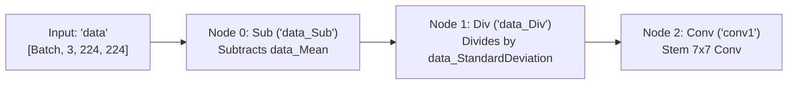

# NetraScan ResNet-18 — Complete ONNX Model Audit Report

**Date of Audit:** September 27, 2026  
**Audited Artifact:** `NetraScan_ResNet18.onnx`  
**Execution Environment:** Local Analysis (CPU / ONNX Runtime)  

---

## 1. Model File Identity

| Attribute | Verified Value | Evidence / Source |
| :--- | :--- | :--- |
| **Filename** | `NetraScan_ResNet18.onnx` | Local Filesystem Inspection |
| **File Size** | `44,786,571` bytes (42.71 MB) | `os.path.getsize()` |
| **SHA-256 Checksum** | `105e88dd30f013c2439d945abdbab4ab892be71d4591332a29a204c79df8d0be` | `hashlib.sha256()` |
| **ONNX IR Version** | `3` | `model.ir_version` |
| **ONNX Opset Version** | `ai.onnx:6` (Domain: `""`, Version: `6`) | `model.opset_import` |
| **Producer Name** | `MATLAB Deep Learning Toolbox` | `model.producer_name` |
| **Producer Version** | `9.8` | `model.producer_version` |
| **Domain** | `""` (Empty string) | `model.domain` |
| **Model Version** | `0` (Default unversioned) | `model.model_version` |
| **Graph Name** | `resnet18` | `graph.name` |
| **Doc String** | `""` (None present) | `model.doc_string` |
| **Custom Metadata Properties** | `[]` (None present) | `model.metadata_props` |

---

## 2. Graph Inputs

The graph defines a single input tensor:

- **Tensor Name:** `data`
- **Data Type:** `FLOAT` (`tensor(float)` / float32)
- **Shape:** `['BatchSize', 3, 224, 224]`
- **Dynamic Dimensions:** Dimension 0 is parameterized as `'BatchSize'` (supports variable batch size: 1, 8, 16, 32, etc.).
- **Channels:** 3 (RGB format)
- **Spatial Resolution:** Height = 224, Width = 224
- **Layout:** NCHW (`[BatchSize, Channels, Height, Width]`)
- **Embedded Preprocessing:** Connected directly to `data_Sub` and `data_Div` nodes.

---

## 3. Embedded Preprocessing

Preprocessing is **embedded directly inside the ONNX computational graph** at the entry stage:



### Exact Constant Tensor Values

#### 1. Mean Subtraction (`data_Mean`)
- **Tensor Name:** `data_Mean`
- **Shape:** `[1, 3, 1, 1]` (float32)
- **Values:**
  - **Channel 0 (R):** `105.38957214355469`
  - **Channel 1 (G):** `56.31496810913086`
  - **Channel 2 (B):** `18.987478256225586`

#### 2. Standard Deviation Normalization (`data_StandardDeviation`)
- **Tensor Name:** `data_StandardDeviation`
- **Shape:** `[1, 3, 1, 1]` (float32)
- **Values:**
  - **Channel 0 (R):** `69.78485107421875`
  - **Channel 1 (G):** `37.996097564697266`
  - **Channel 2 (B):** `20.641403198242188`

> **Clinical/Pipeline Takeaway:** The graph expects unnormalized pixel values on the **0–255 floating point scale**. It automatically shifts and scales the retinal image internally using specific fundus dataset distribution statistics.

---

## 4. Complete Network Architecture

The network consists of **72 computational nodes** organized into a canonical ResNet-18 topology:

### 1. Stem
- `[00] Sub`: `data - data_Mean` $\rightarrow$ `data_Sub`
- `[01] Div`: `data_Sub / data_StandardDeviation` $\rightarrow$ `data_Div`
- `[02] Conv (conv1)`: $64 \times 3 \times 7 \times 7$, stride $(2, 2)$, pad $(3, 3, 3, 3)$ $\rightarrow$ `[Batch, 64, 112, 112]`
- `[03] BatchNormalization (bn_conv1)`: $\epsilon = 1\times 10^{-5}$
- `[04] Relu (conv1_relu)`: $\rightarrow$ `conv1_relu`
- `[05] MaxPool (pool1)`: $3 \times 3$, stride $(2, 2)$, pad $(1, 1, 1, 1)$ $\rightarrow$ `[Batch, 64, 56, 56]`

---

### 2. Stage Res2 (Layer 1) — 64 Channels (56×56)
- **Block `res2a` (Identity Shortcut):**
  - Main branch: Conv $3\times3$ ($64 \to 64$, s=1, p=1) $\rightarrow$ BN $\rightarrow$ ReLU $\rightarrow$ Conv $3\times3$ ($64 \to 64$, s=1, p=1) $\rightarrow$ BN
  - Shortcut: Identity (`pool1`)
  - Element-wise Sum (`res2a`) $\rightarrow$ ReLU (`res2a_relu`) $\rightarrow$ `[Batch, 64, 56, 56]`
- **Block `res2b` (Identity Shortcut):**
  - Main branch: Conv $3\times3$ ($64 \to 64$, s=1, p=1) $\rightarrow$ BN $\rightarrow$ ReLU $\rightarrow$ Conv $3\times3$ ($64 \to 64$, s=1, p=1) $\rightarrow$ BN
  - Shortcut: Identity (`res2a_relu`)
  - Element-wise Sum (`res2b`) $\rightarrow$ ReLU (`res2b_relu`) $\rightarrow$ `[Batch, 64, 56, 56]`

---

### 3. Stage Res3 (Layer 2) — 128 Channels (28×28)
- **Block `res3a` (Downsampling Shortcut):**
  - Main branch: Conv $3\times3$ ($64 \to 128$, s=2, p=1) $\rightarrow$ BN $\rightarrow$ ReLU $\rightarrow$ Conv $3\times3$ ($128 \to 128$, s=1, p=1) $\rightarrow$ BN
  - Shortcut projection: Conv $1\times1$ ($64 \to 128$, s=2, p=0) $\rightarrow$ BN
  - Element-wise Sum (`res3a`) $\rightarrow$ ReLU (`res3a_relu`) $\rightarrow$ `[Batch, 128, 28, 28]`
- **Block `res3b` (Identity Shortcut):**
  - Main branch: Conv $3\times3$ ($128 \to 128$, s=1, p=1) $\rightarrow$ BN $\rightarrow$ ReLU $\rightarrow$ Conv $3\times3$ ($128 \to 128$, s=1, p=1) $\rightarrow$ BN
  - Shortcut: Identity (`res3a_relu`)
  - Element-wise Sum (`res3b`) $\rightarrow$ ReLU (`res3b_relu`) $\rightarrow$ `[Batch, 128, 28, 28]`

---

### 4. Stage Res4 (Layer 3) — 256 Channels (14×14)
- **Block `res4a` (Downsampling Shortcut):**
  - Main branch: Conv $3\times3$ ($128 \to 256$, s=2, p=1) $\rightarrow$ BN $\rightarrow$ ReLU $\rightarrow$ Conv $3\times3$ ($256 \to 256$, s=1, p=1) $\rightarrow$ BN
  - Shortcut projection: Conv $1\times1$ ($128 \to 256$, s=2, p=0) $\rightarrow$ BN
  - Element-wise Sum (`res4a`) $\rightarrow$ ReLU (`res4a_relu`) $\rightarrow$ `[Batch, 256, 14, 14]`
- **Block `res4b` (Identity Shortcut):**
  - Main branch: Conv $3\times3$ ($256 \to 256$, s=1, p=1) $\rightarrow$ BN $\rightarrow$ ReLU $\rightarrow$ Conv $3\times3$ ($256 \to 256$, s=1, p=1) $\rightarrow$ BN
  - Shortcut: Identity (`res4a_relu`)
  - Element-wise Sum (`res4b`) $\rightarrow$ ReLU (`res4b_relu`) $\rightarrow$ `[Batch, 256, 14, 14]`

---

### 5. Stage Res5 (Layer 4) — 512 Channels (7×7)
- **Block `res5a` (Downsampling Shortcut):**
  - Main branch: Conv $3\times3$ ($256 \to 512$, s=2, p=1) $\rightarrow$ BN $\rightarrow$ ReLU $\rightarrow$ Conv $3\times3$ ($512 \to 512$, s=1, p=1) $\rightarrow$ BN
  - Shortcut projection: Conv $1\times1$ ($256 \to 512$, s=2, p=0) $\rightarrow$ BN
  - Element-wise Sum (`res5a`) $\rightarrow$ ReLU (`res5a_relu`) $\rightarrow$ `[Batch, 512, 7, 7]`
- **Block `res5b` (Identity Shortcut) [GRAD-CAM TARGET LAYER]:**
  - Main branch: Conv $3\times3$ ($512 \to 512$, s=1, p=1) $\rightarrow$ BN $\rightarrow$ ReLU $\rightarrow$ Conv $3\times3$ ($512 \to 512$, s=1, p=1) $\rightarrow$ BN
  - Shortcut: Identity (`res5a_relu`)
  - Element-wise Sum (`res5b`) $\rightarrow$ ReLU (`res5b_relu`) $\rightarrow$ `[Batch, 512, 7, 7]`

---

### 6. Classification Head
- `[68] GlobalAveragePool (pool5)`: Reduces `[Batch, 512, 7, 7]` $\rightarrow$ `[Batch, 512, 1, 1]`
- `[69] Conv (new_fc)`: $1\times 1$ Conv, weight shape `[5, 512, 1, 1]`, bias shape `[5]` $\rightarrow$ `[Batch, 5, 1, 1]`
- `[70] Flatten (prob_Flatten)`: `axis=1` $\rightarrow$ `[Batch, 5]`
- `[71] Softmax (prob)`: `axis=1` $\rightarrow$ `[Batch, 5]`

---

## 5. ResNet-18 Verification

- **Number of Residual Stages:** 4 (`res2`, `res3`, `res4`, `res5`)
- **Blocks per Stage:** `[2, 2, 2, 2]` (8 basic residual blocks)
- **Total Convolutions:** 21 Convolutions (1 Stem + 16 Residual Block Convs + 3 Shortcut Projections + 1 Classification Conv)
- **Channel Progression:** $64 \to 128 \to 256 \to 512$
- **Downsampling Locations:** Stages `res3a`, `res4a`, and `res5a` via stride 2 convolutions and $1\times 1$ projection shortcuts.
- **Final Feature Dimension:** $512 \times 7 \times 7$

**RESNET-18 ARCHITECTURE VERIFIED:** **YES**

---

## 6. Parameter Count

| Component / Stage | Parameter Count | Tensor Count | Description |
| :--- | :--- | :--- | :--- |
| **Preprocessing Constants** | 6 | 2 | `data_Mean`, `data_StandardDeviation` |
| **Stem (`conv1`, `bn_conv1`)** | 9,728 | 6 | Conv weights, bias, BN scale/bias/mean/var |
| **Stage 2 (`res2a`, `res2b`)** | 148,736 | 16 | 4 Convs, 4 BNs |
| **Stage 3 (`res3a`, `res3b`)** | 527,488 | 20 | 5 Convs (incl. $1\times 1$ shortcut), 5 BNs |
| **Stage 4 (`res4a`, `res4b`)** | 2,103,552 | 20 | 5 Convs (incl. $1\times 1$ shortcut), 5 BNs |
| **Stage 5 (`res5a`, `res5b`)** | 8,401,408 | 20 | 5 Convs (incl. $1\times 1$ shortcut), 5 BNs |
| **Classification Head (`new_fc`)** | 2,565 | 2 | $5 \times 512$ weights + 5 biases |
| **TOTAL STORED PARAMETERS** | **11,193,483** | **86** | Total elements across all initializers |
| **Learnable Parameters** | **11,183,883** | **64** | Weights + Biases + BN $\gamma, \beta$ |
| **Non-Learnable Parameters** | **9,600** | **20** | BN Running Means and Running Variances |

---

## 7. Outputs & Classification Format

- **Output Name:** `prob`
- **Shape:** `['BatchSize', 5]`
- **Data Type:** `FLOAT` (`tensor(float)`)
- **Output Nature:** **Normalized Softmax Probabilities** (Sum of outputs $= 1.0$)
- **Number of Output Classes:** 5

---

## 8. Class Count and Class Mapping

- **Number of Classes:** 5
- **Embedded Class Mapping:** **CLASS MAPPING NOT EMBEDDED IN ONNX — mapping must come from external application code/configuration.**
- *Application Mapping (NetraScan ICDR Standard):*
  - Index 0 $\rightarrow$ Grade 0 (No Diabetic Retinopathy)
  - Index 1 $\rightarrow$ Grade 1 (Mild Non-Proliferative DR)
  - Index 2 $\rightarrow$ Grade 2 (Moderate Non-Proliferative DR)
  - Index 3 $\rightarrow$ Grade 3 (Severe Non-Proliferative DR)
  - Index 4 $\rightarrow$ Grade 4 (Proliferative DR)

---

## 9. Model Output Semantics

1. **Logits vs Probabilities:** The output is **Probabilities**, not unnormalized logits. Node 71 executes an explicit `Softmax(axis=1)`.
2. **Predicted Grade:** $\text{Grade} = \text{argmax}(\mathbf{p})$, where $\mathbf{p} \in \mathbb{R}^5$.
3. **AI Confidence:** $\text{Confidence} = \max(\mathbf{p}) = \mathbf{p}[\text{Grade}]$.
4. **Clinical Referability Formula:**
   $$P_{\text{referable}} = \mathbf{p}[2] + \mathbf{p}[3] + \mathbf{p}[4]$$
   $$\text{Referable Decision} = \begin{cases} \text{True (Referral Required)}, & \text{if } P_{\text{referable}} \ge 0.35 \\ \text{False (Routine Care)}, & \text{if } P_{\text{referable}} < 0.35 \end{cases}$$

---

## 10. Grad-CAM / Explainability Target Layer

- **Target Node:** `res5b_relu` (Node 67)
- **Output Tensor Name:** `res5b_relu`
- **Tensor Shape:** `[BatchSize, 512, 7, 7]`
- **Network Position:** Final post-activation convolutional feature map immediately before Global Average Pooling (`pool5`).
- **Grad-CAM Suitability:** **Optimal.** Contains the highest-level spatial semantic features and receptive fields ($224\times224$ receptive field mapped to $7\times7$ grid).

---

## 11. Inference Characteristics & Complexity

- **Multiply-Accumulate Operations (MACs):** `1,813,563,904` (1.814 GMACs per $224\times224$ image)
- **Floating Point Operations (FLOPs):** `~3,627,127,808` (~3.627 GFLOPs)
- **Largest Activation Tensor:** `conv1_relu` (`[1, 64, 112, 112]` = 802,816 floats $\approx 3.21$ MB)
- **Final Feature Map Size:** $512 \times 7 \times 7$ (25,088 floats)
- **Dynamic Batching:** Supported natively (symbolic `'BatchSize'` on input and outputs).
- **Execution Profile:** Highly efficient for real-time CPU execution in clinical PHC edge settings.

---

## 12. ONNX Runtime Compatibility

- **Operator Set:** `ai.onnx:6` (standard opset)
- **Operators Used:** `Sub`, `Div`, `Conv`, `BatchNormalization`, `Relu`, `MaxPool`, `Sum`, `GlobalAveragePool`, `Flatten`, `Softmax`
- **Custom / MATLAB-specific Operators:** None. All operators are standard ONNX primitive ops.
- **Provider Support:** Fully compatible with `CPUExecutionProvider` (as well as `CUDAExecutionProvider`, `CoreMLExecutionProvider`).

---

## 13. Verified Metadata for NetraScan UI

```yaml
MODEL NAME: NetraScan ResNet-18
MODEL ARTIFACT: NetraScan_ResNet18.onnx
ARCHITECTURE: ResNet-18
RUNTIME: ONNX Runtime
INPUT SIZE: 224x224x3
OUTPUT CLASSES: 5
TARGET LAYER: res5b_relu
MODEL SHA-256: 105e88dd30f013c2439d945abdbab4ab892be71d4591332a29a204c79df8d0be
```

---

## 14. Training Information

- **Dataset / Training Hyperparameters:** **NOT PRESENT IN ONNX**
- **Loss Function / Optimizer / Learning Rate:** **NOT PRESENT IN ONNX**
- **Validation Accuracy / Sensitivity / Specificity / AUC:** **NOT PRESENT IN ONNX**
- **Training Epochs / Dates:** **NOT PRESENT IN ONNX**

---

## 15. Final Feature Inventory

| Feature | Verified Value | Evidence Source |
| :--- | :--- | :--- |
| **Architecture** | ResNet-18 (5-Class) | Complete graph layer reconstruction (72 nodes) |
| **Residual Blocks** | 8 basic residual blocks (2 per stage) | Node graph inspection |
| **Input Shape** | `['BatchSize', 3, 224, 224]` | `graph.input[0]` |
| **Channels** | 3 (RGB) | `graph.input[0].type.tensor_type.shape` |
| **Embedded Preprocessing** | Mean subtraction & StdDev scaling | Nodes `data_Sub` and `data_Div` |
| **Mean Values** | `[105.390, 56.315, 18.987]` | Initializer `data_Mean` |
| **StdDev Values** | `[69.785, 37.996, 20.641]` | Initializer `data_StandardDeviation` |
| **Output Count** | 1 (`prob`) | `graph.output` |
| **Class Count** | 5 | Shape of `new_fc_W` and `prob` |
| **Class Mapping** | Not embedded in ONNX | Graph string / metadata search |
| **Softmax** | Embedded (`Softmax(axis=1)`) | Node `prob` (Node 71) |
| **Grad-CAM Layer** | `res5b_relu` ($[N, 512, 7, 7]$) | Node `res5b_relu` (Node 67) |
| **Stored Parameters** | 11,193,483 | Initializers array calculation |
| **ONNX Opset** | `ai.onnx:6` | `model.opset_import` |
| **Runtime Compatibility** | `CPUExecutionProvider` | Executed via ONNX Runtime Python API |
| **Dynamic Batch** | Supported (`BatchSize`) | Graph symbolic dimension |
| **Producer** | `MATLAB Deep Learning Toolbox 9.8` | `model.producer_name` |
| **SHA-256** | `105e88dd30f013c2439d945abdbab4ab892be71d4591332a29a204c79df8d0be` | SHA-256 computation on raw file bytes |

---

## 16. Critical Separation

### A. Verified Directly from ONNX
1. File size (`44,786,571` bytes) and SHA-256 checksum (`105e88dd30f013c2439d945abdbab4ab892be71d4591332a29a204c79df8d0be`).
2. ONNX IR version (3), Opset (6), Producer (`MATLAB Deep Learning Toolbox 9.8`).
3. Single input tensor `data` with shape `['BatchSize', 3, 224, 224]` and float32 dtype.
4. Embedded preprocessing nodes: `data_Sub` (`data_Mean = [105.390, 56.315, 18.987]`) and `data_Div` (`data_StandardDeviation = [69.785, 37.996, 20.641]`).
5. All 72 computational nodes, including 21 Convolutions, 20 Batch Normalizations, 17 ReLUs, 8 Elementwise Sums, 1 MaxPool, 1 GlobalAveragePool, 1 Flatten, 1 Softmax.
6. 4 residual stages with `[2, 2, 2, 2]` basic block structure and $64 \to 128 \to 256 \to 512$ channel progression.
7. Grad-CAM feature activation node `res5b_relu` outputting `[BatchSize, 512, 7, 7]`.
8. Classification head `new_fc` producing 5 output scores followed by `Softmax`.
9. Total parameter count: 11,193,483 parameters across 86 initializer tensors.

### B. Derived from ONNX Graph
1. ResNet-18 architecture classification (derived from block count, kernel sizes, downsampling projections, and residual topology).
2. Computational complexity: 1.814 GMACs / ~3.627 GFLOPs per $224\times224$ image.
3. Clinical referability formula derivation ($P_{\text{referable}} = \sum_{i=2}^4 p_i$).
4. Compatibility with ONNX Runtime CPUExecutionProvider (derived from 100% standard ONNX opset 6 operator inventory).

### C. Not Present / Cannot Be Determined from ONNX
1. Clinical class names / human-readable ICDR severity labels (Grade 0–4 names are not embedded as metadata).
2. Training dataset name, patient cohort, PHC location.
3. Hyperparameters (learning rate, loss function, epochs, optimizer, weight decay).
4. Validation performance metrics (Accuracy, Sensitivity, Specificity, AUC).
5. Clinical referral threshold (the 0.35 threshold is an external clinical decision rule, not an ONNX parameter).
